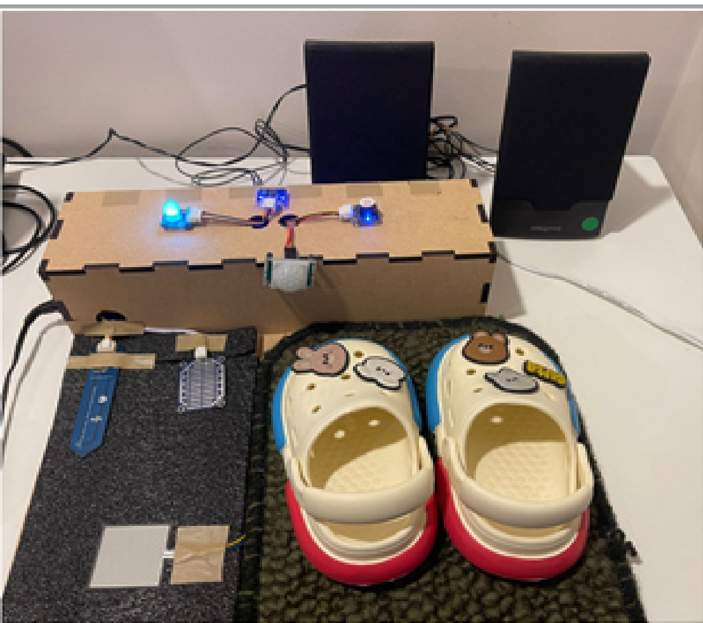
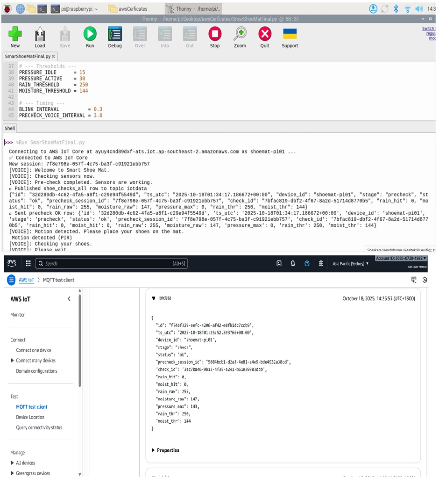
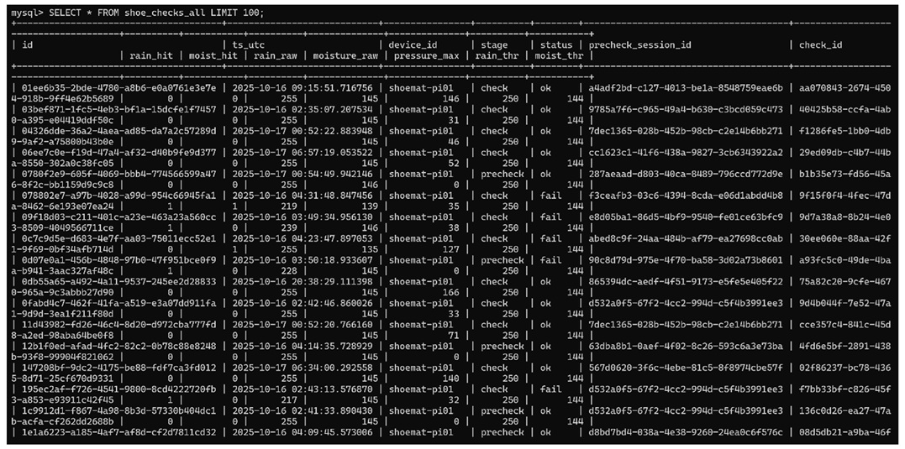
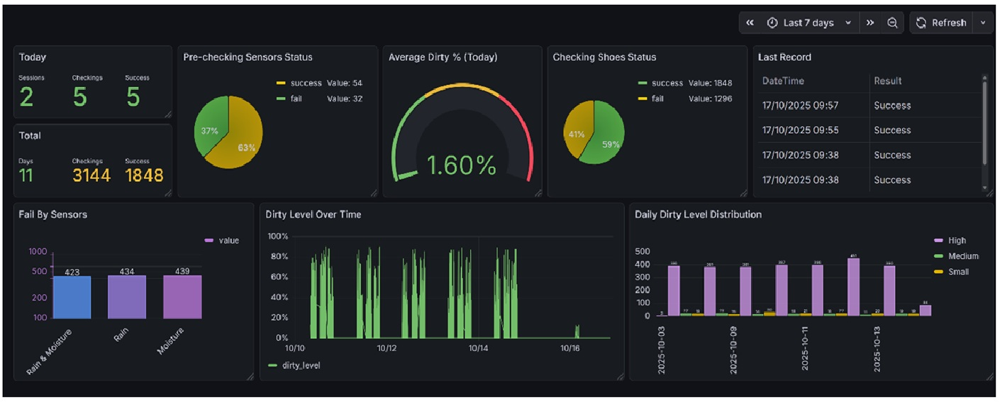

# Smart Shoe Mat System

Smart Shoe Mat System is an IoT-based hygiene monitoring prototype designed to improve cleanliness at entry points such as homes, clinics, schools and public facilities.

The system uses a Raspberry Pi with multiple sensors to detect shoe contact, wetness and possible dirt conditions. It provides real-time feedback using an RGB LED, buzzer and voice messages. Sensor data is also published to AWS IoT Core using MQTT for cloud storage and dashboard visualization.

## Features

- Detects user presence using a PIR motion sensor
- Detects shoe contact using a pressure sensor
- Detects wet or dirty conditions using rain and moisture sensors
- Provides real-time feedback using RGB LED, buzzer and voice messages
- Publishes sensor data to AWS IoT Core using MQTT
- Supports database storage and Grafana dashboard visualization

## Hardware Used

- Raspberry Pi 3B / 3B+
- PCF8591 ADC module
- Pressure sensor
- Rain drop sensor
- Soil moisture sensor
- PIR motion sensor
- RGB LED
- Active buzzer
- Speaker
- Push button or touch input

## System Images

### Final Prototype



### Hardware Circuit


### System Flowchart


### AWS IoT MQTT Message



### MySQL Sensor Data



### Grafana Dashboard



## GPIO Pin Configuration

This project uses Raspberry Pi GPIO BOARD numbering.

| Component | BOARD Pin |
|---|---:|
| Button / Touch Input | 11 |
| RGB LED Red | 12 |
| RGB LED Green | 13 |
| RGB LED Blue | 15 |
| Active Buzzer | 16 |
| PIR Motion Sensor | 18 |

## ADC Channel Configuration

| Sensor | PCF8591 Channel |
|---|---:|
| Pressure Sensor | AIN0 |
| Rain Sensor | AIN1 |
| Moisture Sensor | AIN2 |

## Cloud Architecture

The Raspberry Pi publishes sensor data to AWS IoT Core using MQTT. The data can then be processed and stored in a MySQL-compatible database such as Amazon RDS or Aurora. Grafana is used to visualize sensor readings, hygiene status and dirty-level trends.

## Security Notice

AWS IoT certificate files and private keys must not be uploaded to GitHub.

Do not upload these files:

```text
certificate.pem.crt
private.pem.key
AmazonRootCA1.pem
.env